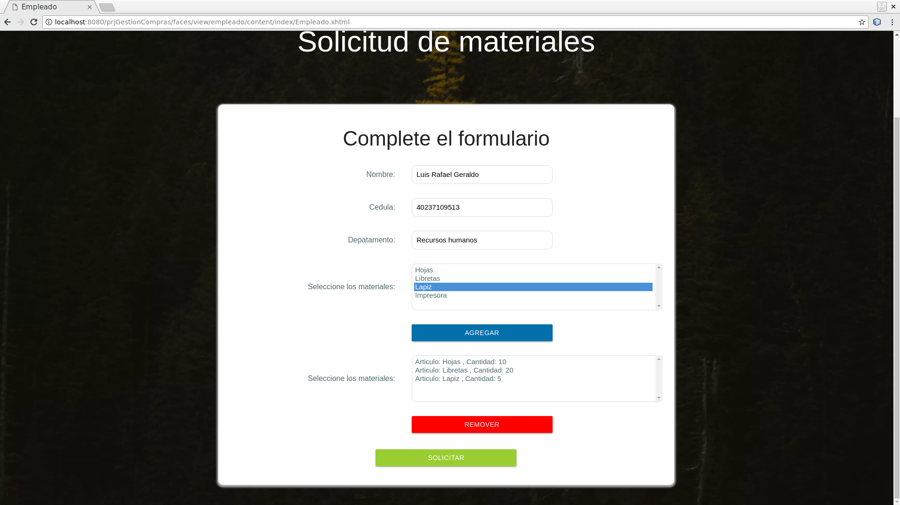

# Gestión de compras
<h1 style="font-family: Arial; text-align: center">Rvia</h1>
<h2>Descripcion</h2>  
     
 

Este sistema tiene como objetivo gestionar el abastecimiento de materiales de oficina por parte de los departamento de una empresa, el mismo automáticamente genera una solicitud de compra con los materiales que soliciten los empleados y no haya en el almacén.

<h2>Tecnologias usadas<h2>
  <h3 style="display: inline; font-family: Arial">Lenguaje de programacion:</h3>
 
  

  <ul> 
    <li>Java</li>
  </ul>
  

 

 
 <h3 style="display: inline; font-family: Arial">Framework:</h3>
  
  
 
    <ul>
      <li>JavaServer Faces</li>
      <li>Materializecss</li>
    </ul>
  

  
  <h3 style="display: inline; font-family: Arial">Herramienta para gestión y construcción de software:</h3>
  
  
 
    <ul>
      <li>Maven</li>
    </ul>
  

  
 
  <h3 style="display: inline; font-family: Arial">Librerias:</h3>
  
  
 
    <ul>
       <li>PrimeFaces</li>
       <li>JQuery</li>
    </ul>
  

  
  <h3 style="display: inline; font-family: Arial">APIs:</h3>
  
  
 
    <ul>
      <li>JPA</li>
      <li>iText</li>
    </ul>
  

  
 <h3 style="display: inline; font-family: Arial">Lenguajes de Presentación:</h3>
  
  
 
    <ul>
      <li>PostgreSQL</li>
    </ul>
  

  
  <h3 style="display: inline; font-family: Arial">Sistema gestor de bases de datos:</h3>
  
  
 
    <ul>
      <li>PostgreSQL</li>
    </ul>
  

  
   
  <h3 style="display: inline; font-family: Arial">Entorno de desarrollo:</h3>
  
  
    <ul>
       <li>NetBeans</li>
       <li>Elephantsql</li>
    </ul>
  
    

<h1>Screenshots de la aplicacion</h1>

<h3 style="display: inline; font-family: Arial">Pantalla inicial</h3>

<h3 style="display: inline; font-family: Arial">Pantalla de login</h3>

<h3 style="display: inline; font-family: Arial">Validacion de la cedula </h3>

<h3 style="display: inline; font-family: Arial">Validacion de usuario</h3>

<h3 style="display: inline; font-family: Arial">Vista departamental</h3>

<h3 style="display: inline; font-family: Arial">Vista departamental</h3>

<h3 style="display: inline; font-family: Arial">Seleccion de materiales</h3>

<h3 style="display: inline; font-family: Arial">Las solicitudes de un empleado</h3>

<h3 style="display: inline; font-family: Arial">Vista del administrador/h3>

<h3 style="display: inline; font-family: Arial">Listas de solicitudes realizadas/h3>

<h3 style="display: inline; font-family: Arial">Detalle de una solicitud/h3>

<h3 style="display: inline; font-family: Arial">Solicitud aprobada/h3>

En este caso algunos articulos de la solicitud excedian la cantidad de ejemplares inventariados, por eso se genero una solicitud de compra

